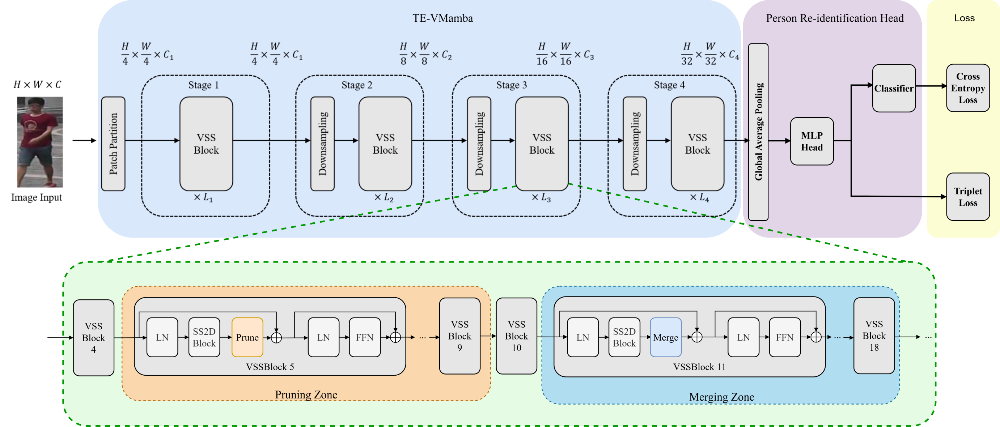

# TE-VMamba: SSM-Aware Token-Efficient VMamba via Adaptive Patch Pruning and Merging for Person Re-Identification

Official implementation of **TE-VMamba**, a VMamba-based framework for efficient person re-identification.

> [Paper](https://openaccess.thecvf.com/content/CVPR2026/papers/Huang_SSM-Aware_Token-Efficient_VMamba_via_Adaptive_Patch_Pruning_and_Merging_for_CVPR_2026_paper.pdf) has been accepted by CVPR-2026
> [Video](https://www.youtube.com/watch?v=DGkmCfocnkQ)

## Pipeline



## Environment Setup

```sh
conda create -n TEvmamba python=3.10
conda activate TEvmamba
pip install -r requirements.txt
cd kernels/selective_scan && pip install .
```

## Prepare Datasets
```
Download the datasets manually and organize them as follows:
data
├── Market1501
│ ├── bounding_box_train
│ ├── bounding_box_test
│ └── query
├── MSMT17
│ ├── bounding_box_train
│ ├── bounding_box_test
│ └── query
├── CUHK03
│ └── ...
├── Occluded_ReID
│ └── ...

```
Please modify the dataset path in the configuration file accordingly.

## Training

Example training command:

```bash
python train.py --config_file configs/Market/v2v_base.yml
```

## Evaluation

Example evaluation command:

```bash
python test.py --config_file configs/Market/v2v_base.yml TEST.WEIGHT '/path/to/checkpoint.pth'
```
